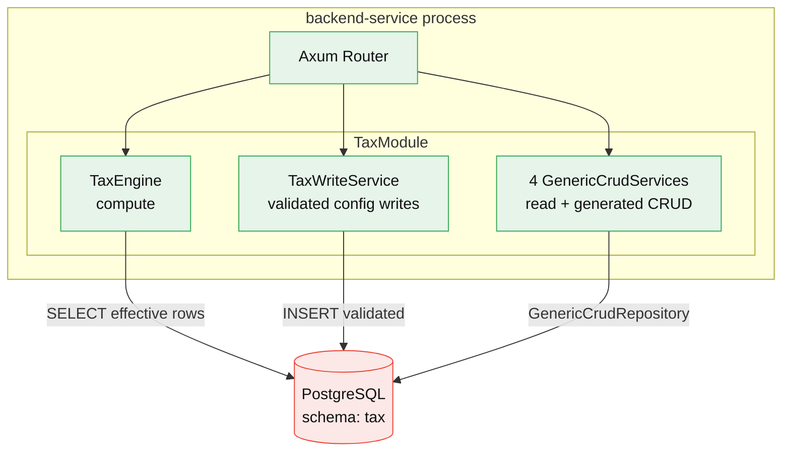

# Architecture — backbone-tax

> **Reader:** Maintainer (and Evaluator for the Context view). **Mode:** explanation.
> How the module is shaped and how a compute request flows end-to-end. C4, top-down.
> Source of truth: `schema/models/*.model.yaml`, `src/`, the two ADRs. When this page and the
> code disagree, the code wins — fix this page.

`backbone-tax` is a **library crate** (`[lib]` only, no `main.rs`). It is compiled into a
`backend-service` (e.g. `backbone-application`), which owns the HTTP server, the Postgres pool, and
the composition of many modules. This page describes the tax module and the seams around it.

## Level 1 — Context

Who talks to the tax engine, and who it deliberately does **not** talk to.

```mermaid
graph LR
  admin([Tax admin]):::actor -->|configure templates,<br/>effective-dated rates| TAX
  billing([Producing module<br/>billing / selling / buying]):::actor -->|calculate(template, base, date)| TAX
  TAX[[backbone-tax<br/>engine + config]]:::sys -->|returns TaxLine array| billing
  billing -->|attaches lines to| ACC[[backbone-accounting<br/>AccountingPost → GL]]:::sys
  TAX -.->|logical FK account_id<br/>NO Cargo edge, NO DB FK| ACC
  TAX -->|created_by / updated_by| SAP[[backbone-sapiens<br/>User identity]]:::sys
  classDef actor fill:#e8f0fe,stroke:#4285f4,color:#111;
  classDef sys fill:#fef7e0,stroke:#f9ab00,color:#111;
```

**Notice:** the arrow from tax to accounting is *dashed* — it is a **logical** reference
(`account_id` is a UUID pointing at `accounting.Account.id`, marked
`@exclude_from_foreign_key_check`), not a compile-time or database dependency. Tax imports nothing
from accounting; billing, not tax, posts to the GL. This is the boundary ADR-001 exists to protect.

## Level 2 — Containers

The runtime pieces the module lives inside.



**Notice:** the module exposes **three** write/compute surfaces, and they are not equal in trust:

| Surface | Mounted by | Trust | What it does |
|---------|-----------|-------|--------------|
| `TaxEngine` | `create_guarded_tax_routes` | compute | `POST /tax/calculate`, `POST /tax/withholding` — returns lines |
| `TaxWriteService` | `create_guarded_tax_routes` | **validated** | `POST /tax-categories`, `/tax-templates`, `/tax-template-rows`, `/withholding-categories` — unique code, template existence, non-overlapping windows |
| `GenericCrudService` ×4 | `all_crud_routes()` | **unguarded** | full generated CRUD (12 endpoints/entity), no domain validation |

For any real deployment, compose [`create_guarded_tax_routes(&module)`](../src/presentation/http/guarded_routes.rs):
read + validated writes + compute. `all_crud_routes()` is admin/seed-only; `TaxModule::routes()` is
`#[deprecated]` because "the routes" reads harmless but mounts the unguarded surface. See
[fsd.md](fsd.md#endpoints).

## Level 3 — Components (the DDD 4-layer module)

Every entity is generated across four layers from its `*.model.yaml`. The tax **engine** and
**write service** are the hand-authored exceptions that live inside those layers.

```
src/
├── lib.rs                     TaxModule + builder — the real composition root
├── domain/                    pure model (generated)
│   ├── entity/                TaxCategory, TaxTemplate, TaxTemplateRow, WithholdingCategory + enums
│   └── repositories/          repository traits (ports)
├── application/
│   ├── service/
│   │   ├── *_service.rs        type alias → GenericCrudService  (generated)
│   │   ├── tax_engine.rs       ★ hand-authored — calculate / resolve_withholding
│   │   └── tax_write_service.rs ★ hand-authored — validated config writes
│   └── dto/                    Create/Update/Patch/Response  (generated)
├── infrastructure/
│   └── persistence/           *_repository.rs newtype → GenericCrudRepository  (generated)
├── presentation/
│   └── http/
│       ├── *_handler.rs        BackboneCrudHandler wiring  (generated)
│       └── guarded_routes.rs   ★ hand-authored — the recommended mount
└── routes/mod.rs              stateless / stateful composers  (generated)
```

★ = user-owned (never regenerated). The regen boundary is declared in
[`metaphor.codegen.yaml`](../metaphor.codegen.yaml): `tax_engine.rs`, `tax_write_service.rs`,
`guarded_routes.rs`, the golden tests, the overlap-exclude migration, and `docs/**` survive
`metaphor schema schema generate --force`. Everything else in `src/` is overwritten from the schema, so
per-entity edits go **inside `// <<< CUSTOM … // END CUSTOM` markers** or a sibling `*_custom.rs`.

**Notice:** `TaxCategory` / `TaxTemplate` / `TaxTemplateRow` / `WithholdingCategory` are pure config
master data — no state machine (`schema/hooks/tax.hook.yaml` declares `state_machines: []`). Their
lifecycle *is* effective-dating, not a status graph.

## Level 4 — Data & control flow: `POST /tax/calculate`

One request, traced from the wire to the returned lines. Read alongside
[`tax_engine.rs`](../src/application/service/tax_engine.rs).

```mermaid
sequenceDiagram
  participant C as Caller (billing)
  participant H as guarded_routes::calculate
  participant E as TaxEngine
  participant DB as Postgres (tax schema)
  C->>H: POST /tax/calculate {templateId, baseAmount, onDate}
  H->>E: calculate(template_id, base_amount, on_date)
  E->>E: base_amount < 0 ? → 422 negative_base
  E->>DB: SELECT is_inclusive FROM tax.tax_templates WHERE id=$1
  DB-->>E: is_inclusive (or none → 422 template_not_found)
  E->>DB: SELECT DISTINCT ON (sort_order) … effective on $2 ORDER BY sort_order, effective_from DESC
  DB-->>E: one row per sort_order (newest-effective wins)
  E->>E: empty ? → 422 no_effective_rate
  alt inclusive template
    E->>E: reject non-on_net_total rows → 422 inclusive_cumulative_unsupported
    E->>E: net = gross / (1 + Σ on_net%); last on_net line absorbs residual so Σ lines == gross
  else exclusive template
    E->>E: on_net_total → rate% of net; on_previous_row_total → rate% of running; actual → fixed
  end
  E-->>H: Vec<TaxLine> (withholding rows negative)
  H-->>C: 200 [{accountId, rate, taxAmount, isWithholding, description}]
```

**Notice three invariants the flow enforces** (all from [ADR-002](adr/ADR-002-effective-window-overlap-and-inclusive-reconciliation.md)):

1. **One row per `sort_order`.** `DISTINCT ON (sort_order) … ORDER BY effective_from DESC` makes the
   read path deterministic even if two overlapping rows exist. Belt-and-suspenders: `add_row`
   rejects overlaps (422 `overlapping_effective_window`) *and* an `EXCLUDE USING gist` DB constraint
   (`btree_gist`, migration `…020`) makes them unrepresentable. Without this, a plausible admin edit
   (add 12% without closing 11%) silently returned 23% tax.
2. **Inclusive reconciles exactly.** `Σ lines == gross − net` to the cent — the last `on_net` line
   absorbs the rounding residual — so the caller's `AccountingPost` balances (accounting rejects an
   unbalanced post).
3. **Money is exact IDR:** 2 decimals, round-half-up (`MidpointAwayFromZero`), applied per line.

## Where new code goes (quick index for maintainers)

| Change | Edit first | Then |
|--------|-----------|------|
| New field / entity | `schema/models/*.model.yaml` | `metaphor make entity <Name>`, then a migration |
| Change a rate | **no code** — insert a new effective-dated row (`POST /tax-template-rows`) | old row stays; windows must not overlap |
| New engine rule | `schema/hooks/tax.hook.yaml` (declare) + `tax_engine.rs` (implement) | add a golden case in `tests/tax_golden_cases.rs` |
| New validated write | `tax_write_service.rs` + `guarded_routes.rs` | both are user-owned |
| New non-CRUD endpoint | `presentation/http/`, mount in `guarded_routes.rs` | never hand-roll CRUD routes |

See [extension-guide.md](extension-guide.md) for the seam and the Indonesia overlay, and
[contributing.md](contributing.md) for how to build and prove a change.
